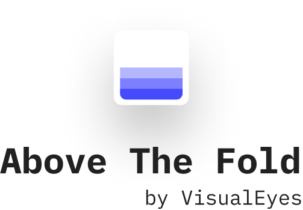

# Above the Fold for Sketch by VisualEyes

  
 

Welcome on board fellow designer!

Below is everything you need to know about our plugin.

You can find out more info on how to use it at [our landing page](https://visualeyes.design/tools/above-the-fold)

## ⚡️ How Above the Fold plugin works?

1. Select one (or more) Artboard(s). 
2. Run the plugin with your desired target device.
3. Your results* are ready!

*The results are seperate layers on top of each Artboard.

## ❓How can Above the Fold section help me?

Above the Fold is the portion of a Web page that is visible in a browser window when the page first loads. Users engage more with the content above the fold than below the fold, thus key site functions and content related to business goals should appear at the top of the Web page.

## 🚨What is the Danger zone?

The viewport is the area where browsers load the web pages and >90% is different to the user's screen size. The browser and OS navigation bars add a dynamic offset to the final viewport. The danger zone represent this offset.

## License 

MIT
